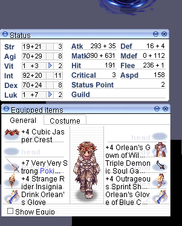
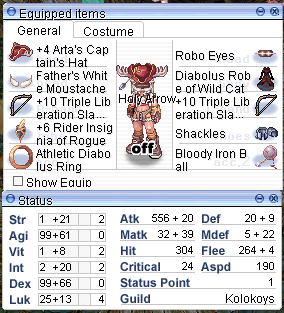

# Ragnarok Pixel Bot

A pixel bot for a certain Ragnarok server with `@jump`, `@warp`, and `@bulksell` commands.

This bypasses Gepard Shield with a certain special hardware. A special GRF must be installed in your client to change the color of the mob to be attacked.

The `bot_scripts` directory contains all the available types of bots that you can run. Typically, the characters (jobs) used of these bots have some type of skill to one hit every mob to be farmed, and has a certain way to heal up their mana so that their net mana is greater than their consumption every kill - one exception to this is the champion bots who go back to town every kill to heal up.

## List of Scripts

### assassin_earth_deleter.js / assassin.js

Farms using Soul Destroyer (F1). This script can also be used on Grand Peco and Dokaebi (Experiment on the gears and lowest required level of SD to be used).

### assassin_raydric.js

Similar to the one above, farms using Soul Destroyer (F1). The only difference is you give up on all the defensive options and go HAM on offense. Make sure to equip Osiris card so your hp and sp are fully restored after being defeated.

### bard_buffs.js / bard_buffs_linked.js

Bard/Clown bots are not farmers but rather act as AFK buffers on town save points. `bard_buffs_linked.js` need another Soul Linker (dual logged) to be able to use Dancer buffs as well.

### champ_4_normies.js

Watered-down champion farming bot. This bot is much slower and yields the least because it always goes back to town every kill. But it is useful for hunting miscellaneous stuff required for quests. Make sure to tweak your gears based on the mob you are hunting

#### Useful for farming

- Sohee - Black Hair for FWM
- Loli Ruri - Black Cat Doll for Alice Doll
- Disguise - Red Muffler for Gangster Scarf
- Aliza - Alice Apron for Alice Doll
- Cecil Damon - Make sure to zoom up so lookup area will be small
- Apocalypse - Metal Fragment for Robo Eye
- Necromancer - card for crafted wand
- PecoPeco - card for V. Coronet (better use the sniper bot for this, just change the map)
- Grand Peco - feather for Filir's Pinion / Peco Ears
- Centipede Larva - card for Red Sombrero
- Thara Frog - card for G. Pipe (better use the sniper bot for this, just change the map)

### champ_abyssmal_knight.js

Similar to champ_4_normies.js but with a lesser hit detection box. Make sure to gear up defensively since it's difficult to survive in Gefenia.

### champ_cecil_damon.js

Similar to champ_abyssmal_knight.js but with a much lesser hit detection box. Make sure to gear up defensively since it's difficult to survive in BioLabs 3.

### sniper.js

The best bang-for-bucks farmer with the least amount of investment needed. But a lot of people are already farming on Dokaebi so it is quite risky.

